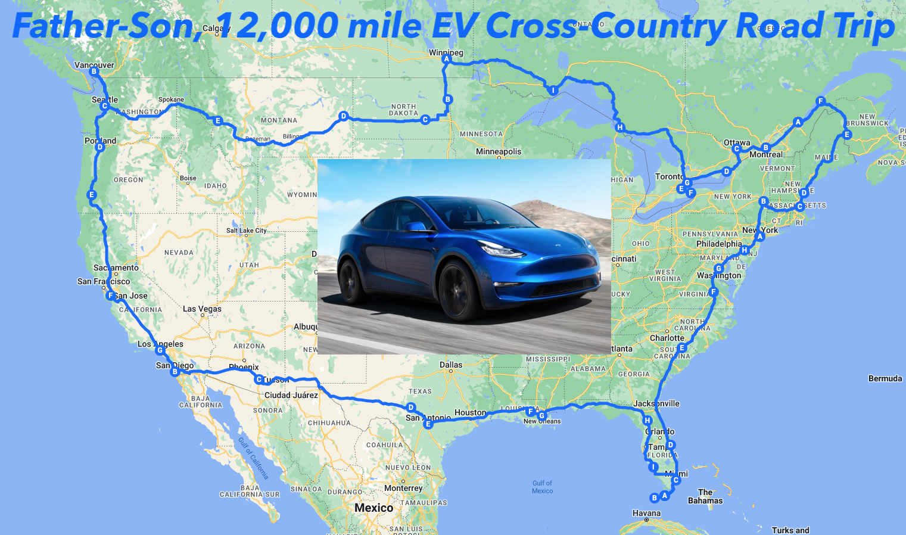
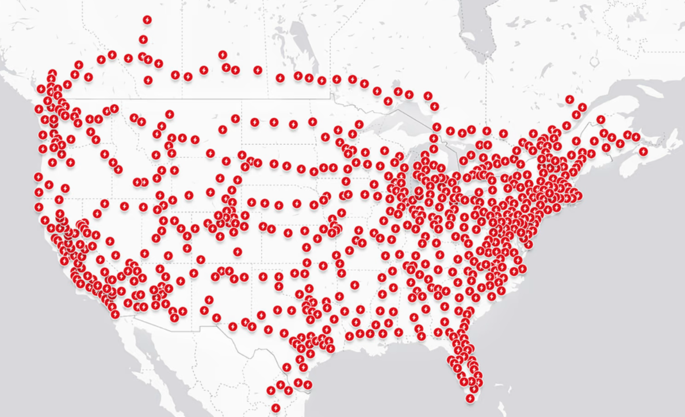
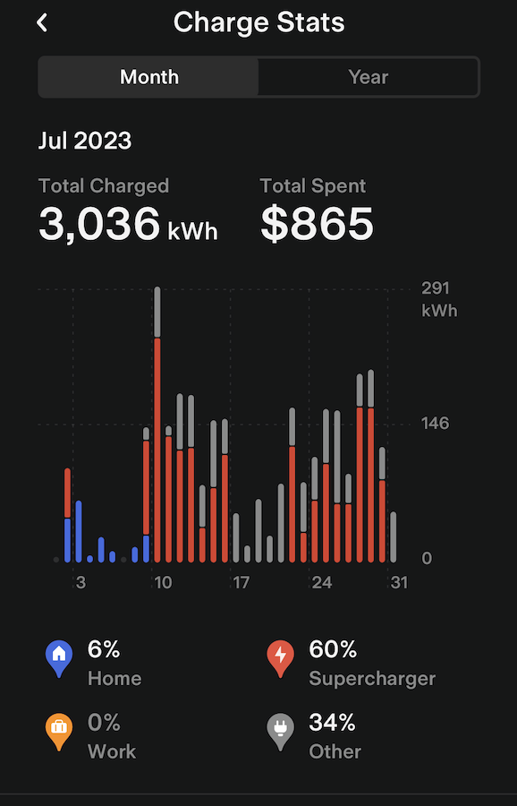
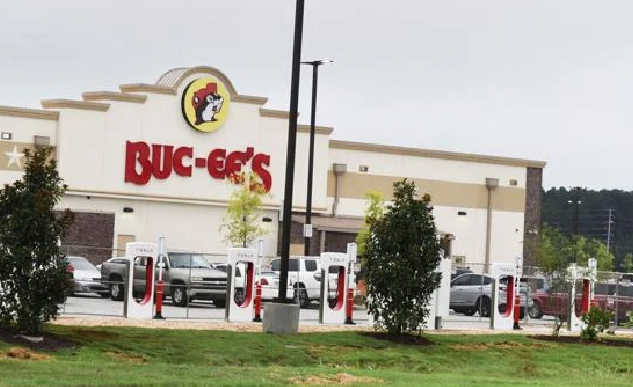
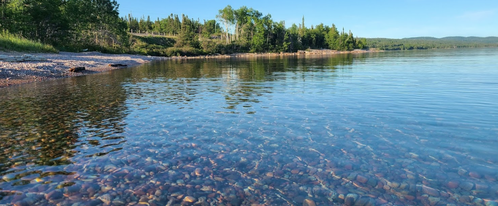

## Introduction

I was recently laid-off from my tech job. Amidst the hustle of that job, I had missed out on precious moments with my 12-year-old son. The constant stress had kept me away from my family. As I think about my next career move, I had an idea: why not take a moment to connect with my son in a way that would create unforgettable memories? My son is interested in geography and US history. He is also an EV enthusiast like myself. Thus we decided to do a month-long, great American summer roadtrip while we have the opportunity.

A good friend reminded me that, after all, my son "will only be 12 years old once".

Our journey took us across nearly 12,000 miles in 28 days in a 2023 Tesla Model Y Performance. The car would become more than just transportation - it would be the foundation to how we would do this cross-country road trip and beyond into Canada. We would circumnavigate the USA and visit interesting cities along the way. The cornerstones of our route are:

* San Diego, CA
* Key West, FL
* Northeastern Maine
* Seattle, WA

  <iframe src="https://www.google.com/maps/d/u/0/embed?mid=1wy6ZdUxPpWyasL6SZ00KsRx0tCBxOVg&ehbc=2E312F" width="100%" height="600"></iframe>

We are no strangers to EV road tripping. In the last 3 years, my son and I have over 40,000 road trip miles in a Model 3 Standard Range (M3SR). That was our preferred method of travel during the pandemic when the risk of flying was high. Thus, we are already familiar with the intricacies of road tripping in an EV, such as the range anxiety and charging station hopping. (My son wants to shout out to [Kyle at Out of Spec](https://twitter.com/itskyleconner) for the inspiration!)

We live in Los Angeles. From there, we have previously visited Portland OR (2000 miles), Denver CO (2000 miles), Austin TX (3000 miles), and Washington, DC (5000 miles). We also do an occassional weekend trip to Las Vegas and northern California. So we were already mentally and logistically prepared for this trip.

## The EV: A 2023 Tesla Model Y Performance

This trip was done in a blue 2023 Tesla Model Y Performance (MYP) called "Midnight", with standard AutoPilot and HW4. When we started, Midnight had about 1,500 miles on it. We ended the trip with about 13,000 miles on the odometer.

Midnight was stock except:

* Swapped the 21” Uberturbines with 19” Gemini for better range and comfort
* Custom wheel covers
* Mud flaps

|  |
|:--:| 
| *The car, "Midnight", at a public charger in Thunder Bay, ON, Canada* |

## Driving: Navigating the Miles

The trip is divided into 6 legs, which are:

| Leg | Description | Start / End Points | Miles |
| --- | --- | --- | --- |
| 1 | Coast to Coast | Los Angeles, CA to Key West, FL | 3000 |
| 2 | Eastern Seaboard | Key West, FL to New York City | 1500 |
| 3 | New England to French Canada | New York City to Quebec, QC | 1000 |
| 4 | Across Canada | Quebec, QC to Winnipeg, MB | 2000 |
| 5 | Northwestern US | Winnipeg, MB to Seattle, WA | 1500 |
| 6 | Western Seaboard | Seattle, WA to Los Angeles, CA | 1500 |

We traveled between 400 - 600 miles a day, with some off days where we visit cities on foot. The MYP was comfortable over long distances. Compared to the M3SR, the ride was smoother and visibility was better. The extra room in the MYP allowed us to carry more gear. However, the stability, handling, and efficiency was better in the M3SR.

**We used AutoPilot (AP) for about 70% of the trip and completely transformed the road trip experience.** AutoPilot lightened the cognitive load and allowed me to cover more distances with less fatigue. In places like west Texas and Montana where the road was straight and traffic was sparse, AP was active virtually the entire time. With AutoPilot engaged, I found it easier to converse with my son and plan our events for the day. Fundamentally, AutoPilot transformed what would have been a tiring drive into a much more relaxed and enjoyable experience.

The MYP is relatively efficient, ranging between 275 - 300 W / mile. Efficiency largely depends on the speed, elevation, and wind direction. This is about 15% less efficient than M3SR. I stayed within 70 - 75 mph for my highway miles. Efficiency plummets in the MYP after 75 mph, so I avoid speeding as much as possible.

## Charging & Range: Supercharger network is great, no range anxiety, so-so costs

We used only Superchargers and public L2 chargers (see EV Camping section below). We charge 2-3 times a day, maybe 1 more on long driving days. Each charge is between 10 - 20 minutes.

|  |
|:--:| 
| *Charging at a busy Supercharger in Ellensburg, Washington* |

**Let me make this clear: there was no range anxiety in the MYP on this trip.** The Tesla Supercharger infrastructure along established routes is very mature. I felt no range anxiety, because there are usually a charger within 50 - 75 miles no matter where I am on the route. I simply punch in my destination for the day, and let the car navigation plan your charge stops. I follow the recommended charging stops, adhere to speed limits, and I arrive very close to the predicted charge level at the stop. This wasn't always true, especially before Tesla navigation accounted for wind speed.

|  |
|:--:| 
| *Superchargers in the US and Canada during the trip* |

**So, let’s dispel the EV charger myth: A Tesla EV can easily circumnavigate the US, today.**

The only time I had a range concern was in North Dakota, where:

1. I deviated from the recommended route
2. I was speeding

In that case, I arrived at a charger with 3%. That is too close for my comfort, especially in a rural area where chargers are sparse.

There was also a time when the weather took out a town's power grid in North Carolina, and the Supercharger went down with the town (interestingly, all the gas stations in the area went down as well). Power was restored in 20 minutes, and chargers were back up. I had a great time talking to other people stuck at the charger.

**Let’s also dispel the myth for a 500-mile range EV.** The real limiting factor is my body, not the car. On a full charge, the MYP can travel 3 hours before the next charge stop on the highway. Personally, I don’t want to drive 3 hours without stretching my legs and using the restroom (Occasionally, I can do it. But it’s tiring and not fun at all). My son becomes irritable after 2 hours. A pit stop every 2 hours or so is welcomed to keep the trip fun and relaxed.

We also find it fun to explore small towns with a Supercharger and experience the locale. Personally, a 300-mile range EV is enough for me.

**Charging costs can be significant given the miles traveled.** A rough, back-of-napkin math suggests that Supercharging costs are similar to driving an efficient hybrid like a Prius or Camry Hybrid. Supercharging costs can differ wildly across Superchargers. In our experience, we have seen between $0.22 to $0.46 per kWh. Interestingly, charging costs usually tracks the local gasoline price (i.e. if gasoline is expensive in the area, charging cost is higher too). We try to look ahead and check the charging rates at multiple chargers along the route to optimize cost. Afterall, charging takes around 50% of our daily travel budget.

|  |
|:--:|
| *Trip charging stats: about 30% free L2 public charging* |

We agressively took advantage of public L2 chargers when we sightsee. If available, this can significantly improve range and cut time and costs. For example, we identified a public L2 charger in the heart of Boston. After sightseeing on the Freedom Trail for the day, the car gained nearly 30% and allowed us to skip a Supercharger on the way to Maine.

## EV Camping: Fun and economical, but infrastructure is still evolving

EV camping is sleeping in the car, using the EV’s electric power to efficiently run the AC overnight to maintain temperature.

The MYP (or any EV) is fantastic for EV camping. We put the rear seats down, put bedding over it, and it fits the two of us comfortably. Tesla Camp Mode maintains a comfortable environment for a good sleep. If we were in an ICE car, the engine would idle the entire night, ticking loudly, and burning fuel. The MYP is quiet and efficient, using only 1% per hour in Camp Mode. The screen also keeps us entertained before bed with Disney+, Netflix, and YouTube. My son had a great time getting extra TV time in.

**We camped in the car for nearly the entire trip, with no hotel stays.** My son and I camped in the car for almost 11,000 miles. We only stayed in a hotel after picking up my wife and daughter in the last leg in Seattle, with about 1,500 miles remaining on the trip. Even then, we managed to fit the 4 of us for a night of EV camping (albeit not comfortably). With EV camping, we eliminated hotel costs and reduced our travel budget by 60% from $300 to $125 per day.

**The biggest problem with EV camping is identifying good locations.** Using PlugShare, we can usually find free, public L2 chargers to camp overnight. However, the location quality is hit and miss. We’ve had good luck with parks and libraries. But some areas have poor public EV charging infrastructure (looking at you, Ottawa and Montana). With an overnight L2 charger, we wake up with 70% - 100% charge running Camp Mode all night. By camping at a free public L2 charger, we save $20 - $25 per day in charging costs and 30 minutes to visit a charger.

|  |
|:--:|
| *Buc'ees rank in the middle on our 20+ criteria rating system* |

**We developed a ranking process using 20+ criteria to rate EV charging locations.** We browse PlugShare and rank the locations for EV camping. These criteria include critical things like working chargers and security, to creature-comfort things like trash cans, restrooms, and benches. The general conclusion: the EV charging infrastructure is mature enough to ensure drivers won’t be stranded, but there are still not enough chargers with basic amenities (For those familiar with Buc'ees, they rank in the middle). In terms of a good EV camping user experience, we are even further away. I would gladly pay $10+ for a great EV camp spot, and would pay even more for food, supplies, and other amenities if available.

## Travel: not just about the driving, but seeing the country in a different way

We made it a priority to explore the locales on the route. After all, America is a big country with a great mix of rural, urban, and suburban areas. Our trip was not just about clocking miles - it was also about connecting my son with everything this country has to offer. This has always been the spirit of the great American road trip. We're simply updating the experience in an EV.

While we had a planned route, oftentimes we just let serendipity, wanderlust, and chance take over. For example:

|  |
|:--:|
| *Ocean view breakfast cook out in Key West, FL* |

|  |
|:--:|
| *Rossport Rest Stop next to Lake Superior, ON* |

* In Key West, we found a beautiful park where we had a relaxing breakfast cook out by the sea
* In Savannah, we ran into the park where Forrest Gump sat (sadly the bench is gone)
* In DC, we randomly ran into the [Transformers sculpture dispute](https://dcist.com/story/23/05/25/optimus-prime-defends-georgetown-transformers-sculptures/) next to Georgetown University
* The drive from NYC to Boston looked boring and expensive with tolls, so we decided on a whim to take the scenic route into Albany through mid-state New York
* On the way to Toronto, ON and Richmond, VA, we met folks at the Supercharger who gave us great dinner recommendations
* On the Trans-Canadian highway, we found an unforgettably beautiful rest stop along Lake Superior where we dipped our toes in the water
* While EV camping in Thunder Bay, ON, a thunderstorm passed overnight. There was lightning and thunder every 15 seconds for 30 minutes that lit up the night sky while rain poured on the car.
* In Winnipeg, we stumbled on a cool downtown festival with music, food, and drinks

In large cities such as NYC and DC, we used public transit instead of driving. Driving and parking in a city is slow and frustrating, and public transit works much better for urban exploration. We would find a public transit parking with L2 charging, then hop onto the transit and sightsee for the day. When we returned to the car, it would gain a significant charge. In NYC, for example, we park the EV in a Jersey City commuter train station with a L2 charger. When we returned, the car gained a 50% charge. 

## Final Thoughts: The great American road trip is viable and fun in an EV, and how father and son learned more about each other

**The EV is a viable and affordable way to experience the great American road trip, but the experience is still improving**. With the mature Supercharger network and the convenience of AutoPilot, EVs bring a refreshing update to the quintessential American road trip experience. Without a doubt, it is possible to traverse the country in an EV today without range anxiety. The EV camping infrastructure remains a work in progress but it has great potential. EV camping makes the trip much more affordable by eliminating hotel costs and reducing charging time and costs. We hope that the EV infrastructure will one day fully align with our system of 20+ criteria, realizing a complete transformation of the EV road trip experience.

Thank you, Tesla, for revolutionizing the auto industry and making this trip possible.

**Ultimately, this is about a father and son spending a month together doing what they love.** I learned a lot about my son, such as his likes and dislikes and his profound shyness around strangers. During the trip, I was proud to work with him to conquer this shyness. In Quebec, he managed to confidently order dinner and ice cream in French. I hope that amidst the long driving stretches, where the days are long and the roads are vast, our conversations have provided my son an insight into his father's life and personality. I also wish that this trip will resonate as one of the cherished and enduring memories my son carries of his father after I am gone.
