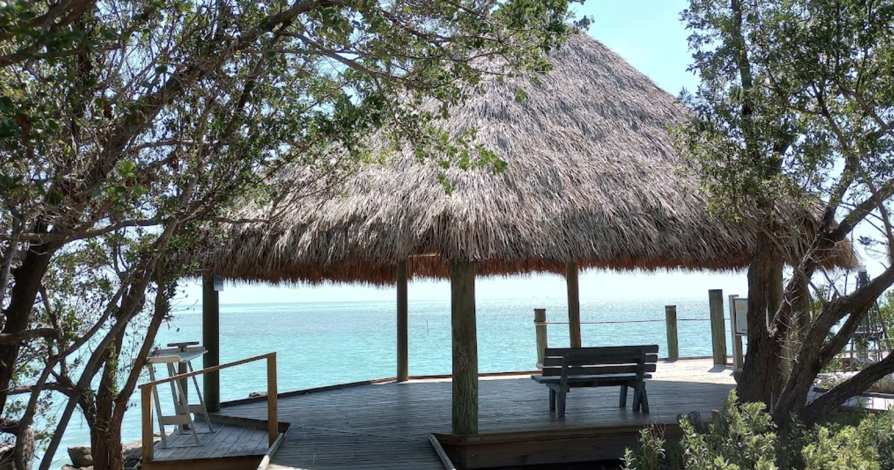

## Introduction

I was recently laid-off from my tech job. Amidst the hustle of that job, I had missed out on precious moments with my 12-year-old son. The constant stress had kept me away from my family. As I think about my next career move, I had an idea: why not take a moment to connect with my son in a way that would create unforgettable memories? My son is interested in geography and US history. He is also an EV enthusiast like myself. Thus we decided to do a month-long, great American summer roadtrip while we have the opportunity.

A good friend reminded me that, after all, my son "will only be 12 years old once".

Our journey took us across nearly 12,000 miles in 28 days in a 2023 Model Y Performance. The car would become more than just transportation - it would be the foundation to how we would do this cross-country road trip and beyond into Canada. We would circumnavigate the USA and visit interesting cities along the way. The cornerstones of our route are:

* San Diego, CA
* Key West, FL
* Northeastern Maine
* Seattle, WA

 

<iframe src="https://www.google.com/maps/d/u/0/embed?mid=1wy6ZdUxPpWyasL6SZ00KsRx0tCBxOVg&ehbc=2E312F" width="800" height="600"></iframe>

 

We are no strangers to EV road tripping. In the last 3 years, my son and I have over 40,000 miles of road trip miles in a Model 3 Standard Range (M3SR). That was our preferred method of travel during the pandemic when the risk of flying was high. Thus, we are already familiar with the related range anxiety and charging station hopping in an EV. We live in Los Angeles. From there, we have previously visited Portland OR, Austin TX, Washington, DC, and the occassional weekend trip to Las Vegas and northern California. So we were already mentally and logistically prepared for this trip.

## The EV: A 2023 Model Y Performance

This trip was done in a blue 2023 Tesla Model Y Performance (MYP) w/ standard AutoPilot and HW4. When we started, the car had about 1,500 miles on it. We eneded the trip with about 13,000 miles on the odometer.

The car was stock except:

* Swapped the 21” Uberturbines with 19” Gemini for efficiency
* Custom wheel covers
* Mud flaps

|  |
|:--:| 
| *Charging at a public charger in Thunder Bay, ON* |

## Driving: Navigating the Miles

The trip was divided into 6 legs, which are:

| Leg | Description | Start / End Points | Miles |
| --- | --- | --- | --- |
| 1 | Coast to Coast | Los Angeles, CA to Key West, FL | 3000 |
| 2 | Eastern Seaboard | Key West, FL to New York City | 1500 |
| 3 | New England to French Canada | New York City to Quebec, QC | 1000 |
| 4 | Across Canada | Quebec, QC to Winnipeg, MB | 2000 |
| 5 | Northwestern US | Winnipeg, MB to Seattle, WA | 1500 |
| 6 | Western Seaboard | Seattle, WA to Los Angeles, CA | 1500 |

We travel between 400 - 600 miles a day, with some off days where we visit cities on foot. The MYP was comfortable over long distances. Compared to the M3SR, the ride was smoother and visibility was better. The extra room in the MYP allowed us to carry more gear. However, the stability, handling, and efficiency was better in the M3SR.

AutoPilot (AP) did about 70% of the driving and was a huge help. In places like west Texas and Montana where the road was straight and traffic was sparse, AP was active virtually the entire time. AutoPilot lightened the cognitive load and allowed me to cover more distances with less fatigue. I also found it easier to converse with my son with AutoPilit engaged. Fundamentally, AutoPilot made this trip possible.

The MYP is relatively efficient compared to other EVs. My efficiency ranges from 275 - 300 W / mile, depending on the speed, elevation, and wind direction. This is about 15% less efficient than M3SR. I stayed within 70 - 75 mph for my highway miles. Efficiency plummets in the MYP after 75 mph, so I avoid speeding as much as possible.

## Charging & Range: Plenty of chargers, no range anxiety, so-so costs

We used only Superchargers and public L2 chargers (see EV Camping section below). We charge 2-3 times a day, maybe 1 more on really long driving days. Each charge is between 10 - 20 minutes.

|  |
|:--:| 
| *Charging at a busy Supercharger in Ellensburg, Washington* |

**Let me make this clear: there was no range anxiety in the MYP on this trip.** The Tesla Supercharger infrastructure along established routes is very mature, and range anxiety is a thing of the past. Simply punch in your destination, and let the car navigation plan your charge stops. Follow recommended charging stops, adhere to speed limits, and you’re good to go.

So, let’s dispel the EV charger myth: A Tesla EV can easily circumnavigate the US, today.

The only time I had a range concern was in North Dakota, where:

1. I didn’t follow the recommended route
2. I was speeding

In that case, I arrived at a charger with 3%. That is too close for my comfort, especially in a rural area where chargers are sparse.

There was also a time when the weather took out a town's power grid in North Carolina, and the Supercharger went down with the town. Power was restored in 20 minutes, and chargers were back up. But I had a great time talking to other people at the charger.

**Let’s also dispel the myth for a 500-mile range EV.** The real limiting factor is my body, not the car. On a full charge, the MYP can travel 3 hours before the next charge stop on the highway. Personally, I don’t want to drive 3 hours without stretching my legs and using the restroom (Once in a while I can do it, but it’s tiring and not fun at all). My son becomes irritable after 2 hours.

We also find it fun to explore small towns with a Supercharger and experience the locale. So, personally, a 300-mile range EV is enough for me.

**Charging costs can be significant given the miles traveled.** A rough, back-of-napkin math suggests that Supercharging costs are similar to driving an efficient hybrid like a Prius or Camry Hybrid. Supercharging costs can differ wildly across Superchargers. In our experience, we have seen between $0.27 to $0.46 per kWh. We usually look ahead and check the rates along the route to optimize cost.

We always take advantage of public L2 chargers when we sightsee. If available, this can really help improve range and cut time and costs. For example, we identified a public L2 charger in the heart of Boston. We went sightseeing on the Freedom Trail for the day, and the car gained nearly 30% and allowed us to skip a Supercharger on the way to Maine.

## EV Camping: Fun and economical, but infrastructure is immature

EV camping is sleeping in the car, using the EV’s electric power to efficiently run the AC overnight to maintain temperature.

The MYP (or any EV) is fantastic for EV camping. We put the rear seats down, put bedding over it, and it fits the two of us comfortably. Tesla Camp Mode maintains a comfortable environment for a good sleep. If we were in an ICE car, the engine would idle the entire night, ticking loudly, and burning fuel. The MYP is quiet and efficient, using only 1% per hour in Camp Mode. The screen also keeps us entertained before bed with Disney+, Netflix, and YouTube. My son had a great time getting extra TV time in.

**An EV made it possible to camp in the car for nearly the entire trip, with no hotel stays.** My son and I slept in the car for almost 11,000 miles. We only stayed in a hotel after picking up my wife and daughter in the last leg in Seattle, with about 1,500 miles remaining on the trip. Even then, we managed to fit the 4 of us for a night of EV camping (albeit not comfortably). With EV camping, we eliminated hotel costs and reduced our travel budget by 60% from $300 to $125 per day.

**The biggest problem with EV camping is identifying a good locations.** Using PlugShare, we can usually find free, public L2 chargers to camp overnight. However, the location quality is hit and miss. We’ve had good luck with parks and libraries. But some areas have poor public EV charging infrastructure (looking at you, Ottawa and Montana). With an overnight L2 charger, we wake up with 70% - 100% running Camp Mode all night. We estimate that camping at a free public L2 charger saves us $20 per night and 30 minutes to visit a charger.

**We developed a ranking process using 20+ criteria to rate an EV camping location.** We would browse PlugShare and rank the location for EV camping. These criteria include critical things like working chargers and security, to creature-comfort things like trash cans, restrooms, and benches. The general conclusion is this: the EV charging infrastructure is mature enough to ensure drivers won’t be stranded, but we are far away from chargers with basic amenities. We are even further away from a good EV camping user experience. I would gladly pay $10+ for a great EV camp spot, and and even more for food, supplies, and other amenities if available.

## Travel: not just about the driving, but to see the country in a different way

We made it a priority to explore the locales on the route. After all, America is a big country with a great mix of rural, urban, and suburban areas. Our trip was not just about clocking miles - it was also about connecting my son with the diversity in this country. This has always been the spirit of the great American road trip. We're simply updating the experience in an EV.

While we had a planned route, oftentimes we just let serendipity, wanderlust, and chance take over. For example:

* In Key West, we found a beautiful park where we had a relaxing breakfast cook out by the sea
* In Savannah, we ran into the park where Forrest Gump sat (sadly the bench is gone)
* In DC, we randomly ran into the [Transformers sculpture dispute](https://dcist.com/story/23/05/25/optimus-prime-defends-georgetown-transformers-sculptures/) next to Georgetown University
* The drive from NYC to Boston looked boring, so we decided on a whim to take the scenic route into Albany through mid-state New York
* On the Trans-Canadian highway, we found an unforgettably beautiful rest stop along Lake Superior where we dipped our toes in the water
* In Winnipeg, we stumbled on a cool downtown festival with music, food, and drinks

In large cities such as NYC and DC, we used public transit instead of driving. Driving and parking in a city is slow and frustrating, and public transit works much better for urban exploration. We find a public transit parking with public L2 charging and park there. Then we hop onto the public transit, site see for the day, and come back to the car with a significant charge. In NYC, for example, we park the EV in a Jersey City commuter train station with a L2 charger. We sight see for the day, and returned to the EV at 90% charge. 

## Final Thoughts: the great American road trip in an EV, and how father-son learned more about each other

<Father and son bonding. I learned about my son, and I hope my son learned about me too. I’m an immigrant with a completely different upbringing my son is experiencing, but I hope the diversity in thoughts would help him.>

<EVs are viable for roadtrips. In fact, the combination of EV camping, autopilot, and reliability, I would argue EVs are preferred. EVs enhance the great American roadtrip>

<Economically effective way to see the country. Flying and staying at hotels would be cost prohibitive. Plus, you get to wanderlust and get pleasantly surprised>